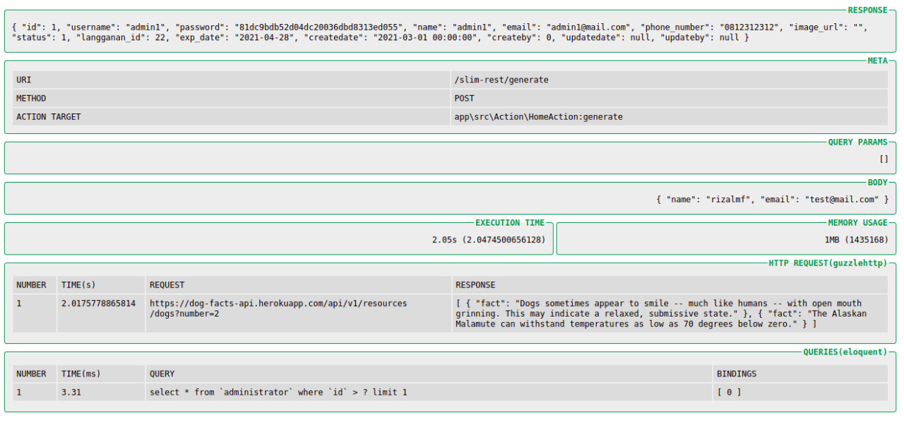
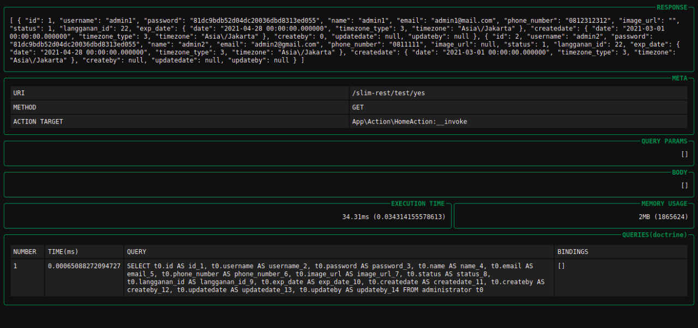

# Slim Simple Profiler

Simple Middleware For Profiling Slim Framework 3. implement awesome library [maximebf/debugbar](http://phpdebugbar.com/).
Inspired by Codeigniter profiler

## Screenshots




## Table of contents

- [Install](#install)
- [Usage](#usage)
  - [Enable/disable darkmode](#Enable/disable-darkmode)
  - [Eloquent/ORM](#eloquent/orm)
  - [Doctrine/ORM](#doctrine/orm)
  - [GuzzleHttp](#guzzlehttp)
  - [Set response format](#set-response-format)
- [License](#license)

## Install 
via "composer require"

```shell
composer require rizalmf/slim-simple-profiler
```

## Usage:

```php

use Simple\Profiler\Profiler;
use Simple\Profiler\Container;

require_once __DIR__ . '/vendor/autoload.php'; // example path

$app = new \Slim\App();

// add middleware
$app->add(new Profiler(new Container()));
```

### Enable/disable darkmode
Set darkmode html format. default: true
```php
// ...
$container = new Container();
$container->setDarkMode(false);

$app->add(new Profiler($container));
```

### Eloquent/ORM
Register \Illuminate\Database\Capsule\Manager to container
```php
//-------- OPTION ONE --------//
// in case you use static Manager

// ...
$DB = new \Illuminate\Database\Capsule\Manager();
$DB->addConnection($settings['your_eloquent_cfg']);

$DB->setAsGlobal();
$DB->bootEloquent();

// register to container
$container->setEloquentManager($DB);

// add middleware
$app->add(new Profiler($container));

//-------- OPTION TWO --------//
// in case you set eloquent to slim container

// ...
$settings = require __DIR__.'/../config/settings.php';
$app = new \Slim\App($settings);

$appContainer = $app->getContainer();

$appContainer['capsule'] = function ($c) {
    $capsule = new \Illuminate\Database\Capsule\Manager;
    $capsule->addConnection($c->get('settings')['your_eloquent_cfg']);

    $capsule->setAsGlobal();
    $capsule->bootEloquent();

    return $capsule;
};

// register capsule to container
$container->setEloquentManager($appContainer['capsule']);

// add middleware
$app->add(new Profiler($container));
```
    
### Doctrine/ORM
Register \Doctrine\DBAL\Logging\DebugStack to container
```php
// ...
$settings = require __DIR__.'/../config/settings.php';
$app = new \Slim\App($settings);

$appContainer = $app->getContainer();

$appContainer['dao'] = function ($c) {
    $settings = $c->get('settings');

    $config = \Doctrine\ORM\Tools\Setup::createAnnotationMetadataConfiguration(
        $settings['doctrine']['meta']['entity_path'],
        $settings['doctrine']['meta']['auto_generate_proxies'],
        $settings['doctrine']['meta']['proxy_dir'],
        $settings['doctrine']['meta']['cache'],
        false
    );
    return \Doctrine\ORM\EntityManager::create($settings['doctrine']['connection'], $config);
};

// first.. you have to bind DebugStack to your entityManager
$logger = new \Doctrine\DBAL\Logging\DebugStack();
$appContainer['dao']->getConnection()
    ->getConfiguration()
    ->setSQLLogger($logger);

// register DebugStack to container
$container->setDoctrineStack($logger);

// add middleware
$app->add(new Profiler($container));
```

### GuzzleHttp
Catch guzzlehttp events via Profiler::guzzleStack()
```php
// ...

$stack = \GuzzleHttp\HandlerStack::create();
$stack->push(\Simple\Profiler\Profiler::guzzleStack());

// set options \GuzzleHttp\Client 
$options['handler'] = $stack;
$client = new \GuzzleHttp\Client($options);
```

### Set response format
Default: Container::HTTP_FORMAT
```php
// ...
$container = new Container();

// response as text/html
$container->setResponseFormat(Container::HTTP_FORMAT);

// response as application/json content-type
$container->setResponseFormat(Container::JSON_FORMAT);

$app->add(new Profiler($container));
```
## LICENSE

The MIT License (MIT)
Copyright (c) 2021 Rizal Maulana Fahmi